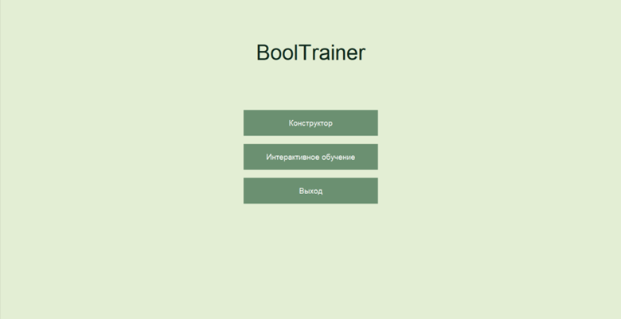
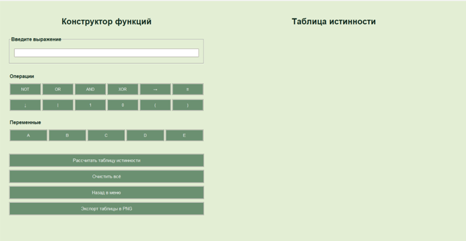
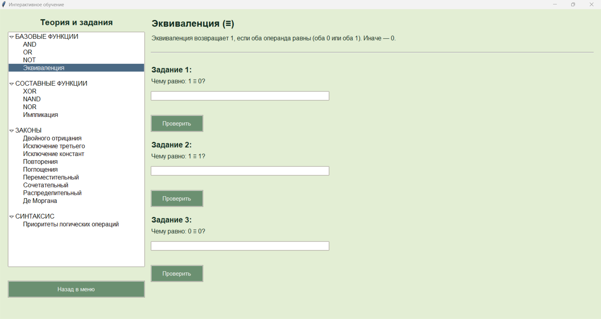

# BoolTrainer

BoolTrainer — графический учебный тренажёр для интерактивного изучения булевых функций и логических выражений.

# Цель проекта

Создание автономного, портативного и интуитивно понятного приложения, которое: 

– Позволяет строить таблицы истинности для булевых выражений;

– Обеспечивает валидацию синтаксиса с понятными сообщениями об ошибках;

– Предоставляет интерактивное обучение с теорией и заданиями;

– Не требует установки и работает без подключения к интернету.

# Основные возможности

– Поддержка 8 логических операций: AND, OR, NOT, XOR, → (импликация), ≡ (эквиваленция), ↓ (стрелка Пирса), | (штрих Шеффера);

– Автоматическое построение таблицы истинности для выражений с переменными A–E;

– Ввод выражения вручную или с помощью кнопок интерфейса;

– Интерактивное обучение с теоретическими модулями и проверяемыми заданиями;

– Экспорт таблицы истинности в формат PNG;

– Полная автономность — работает без Python, интернета и установки;

– Интерфейс на русском языке.

# Используемые технологии

— Язык программирования – Python;

— Графический интерфейс – Tkinter (ttk);

— Экспорт изображений – Matplotlib + Pandas;

— Хранение контента – JSON-файлы;

— Сборка в .exe – PyInstaller;

— Тестирование – pytest.

# Как запустить
## Вариант 1: Из исходного кода
Требования: Python 3.8+

``` bash
# Установка зависимостей
pip install matplotlib pandas

# Запуск
python main.py
```

Все теоретические материалы и задания хранятся в папке theory_cards/ в формате JSON.

## Вариант 2: Готовый исполняемый файл (Windows)

– Скачайте архив с BoolTrainer.exe;

– Распакуйте;

– Запустите main.exe;

– Приложение работает без установки, без интернета, без зависимостей.

# Тестирование
Проект включает автоматизированные тесты на основе pytest:

– Валидация корректных и некорректных выражений;

– Проверка всех логических операций;

– Тестирование ввода, обработки ошибок, вычисления результатов.

Запуск тестов:

``` bash
pytest test.py -v
```

Все тесты проходят успешно — подтверждена корректность работы ядра приложения.

# Структура проекта

BoolTrainer/
├── main.py                 # Точка входа
├── core/                   # Логическое ядро
│   ├── calculator.py       # Вычисление выражений
│   ├── parser.py           # Извлечение переменных
│   └── validator.py        # Валидация синтаксиса
├── ui/                     # Графический интерфейс
│   └── ui.py
├── theory_cards/           # JSON-модули: теория + задания
├── test.py                 # Тесты (pytest)
├── screenshots/            # Скриншоты приложения
│   ├── startmenu.png       # Стартовое меню
│   ├── constructor.png           # Конструктор
│   └── learning.png        # Интерактивное обучение
└── requirements.txt        # Зависимости

# Скриншоты

Рисунок 1 — Главное меню



Рисунок 2 — Режим «Конструктор функций»



Рисунок 3 — Режим «Интерактивное обучение»


